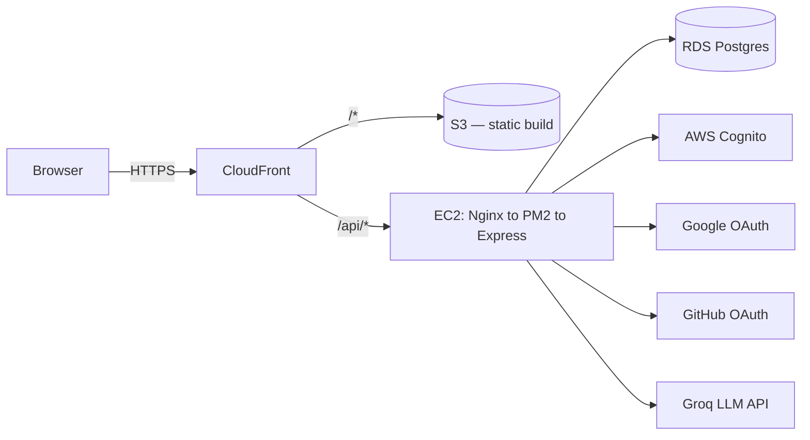
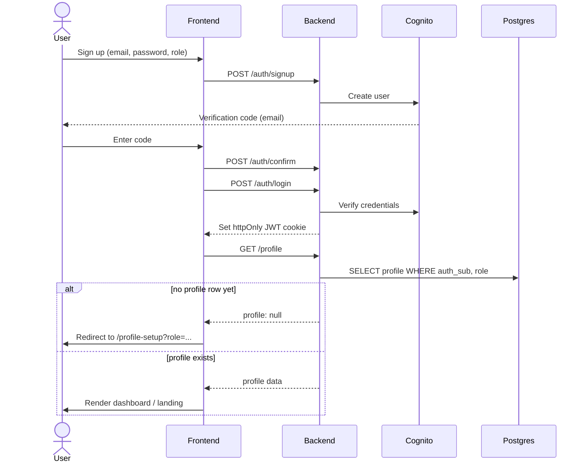
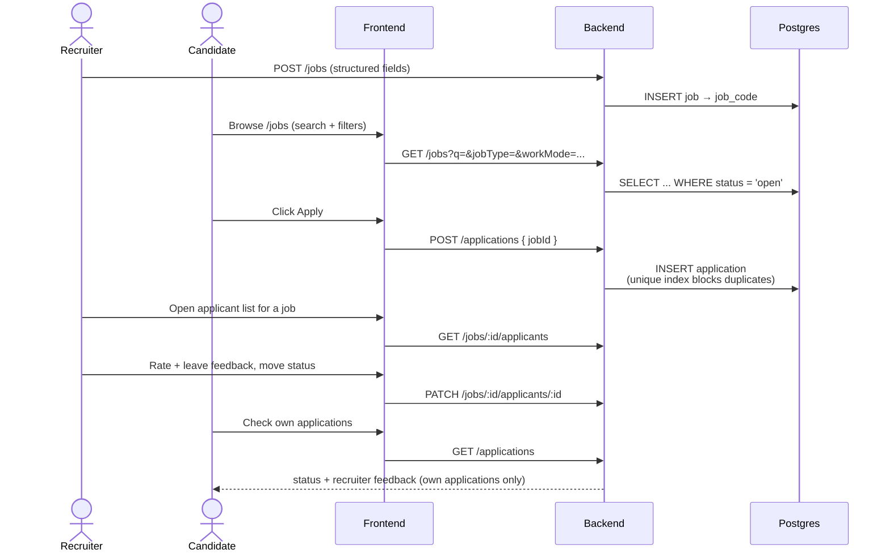
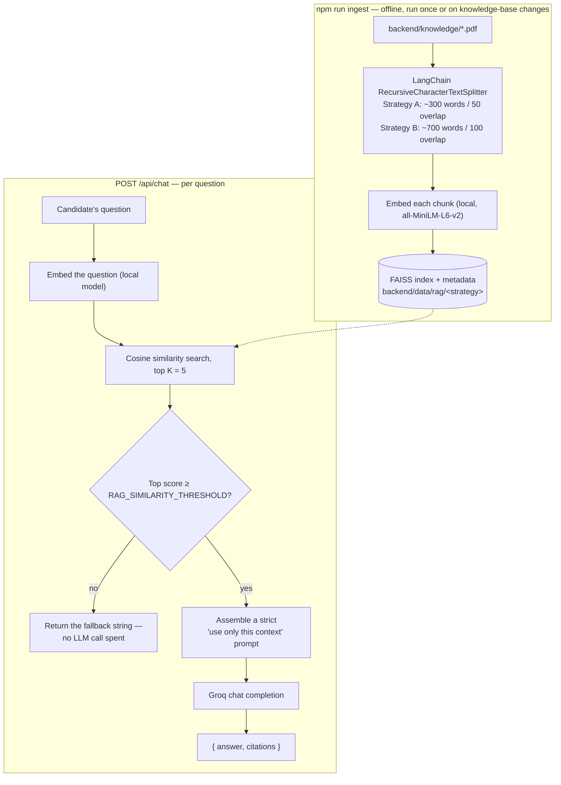
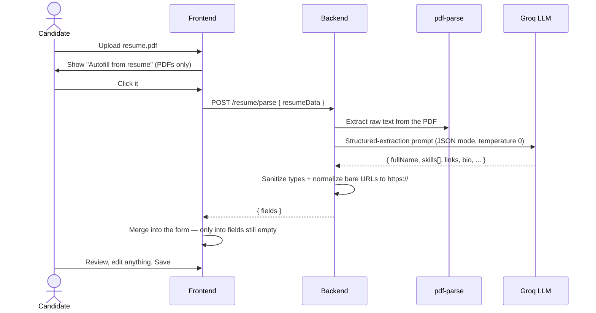

<div align="center">

# Intervu

**AI-native job platform** connecting candidates and recruiters — resume-driven job matching, a two-sided application pipeline, an AI resume assistant grounded in real hiring guides, and one account that can hold both a candidate and a recruiter identity at once.

[](https://github.com/varuntutejaa/intervu/actions/workflows/ci.yml)
[](https://github.com/varuntutejaa/intervu/actions/workflows/deploy.yml)
[](https://github.com/varuntutejaa/intervu/actions/workflows/deploy-frontend.yml)
[](https://github.com/varuntutejaa/intervu/actions/workflows/build-and-push.yml)


**[Live app →](https://d2sbflfh62ti4k.cloudfront.net)**

</div>

---

## Table of contents

- [Overview](#overview)
- [Features](#features)
- [Tech stack](#tech-stack)
- [Architecture](#architecture)
- [Key flows](#key-flows)
- [Frontend architecture](#frontend-architecture)
- [AI Resume Assistant (RAG pipeline)](#ai-resume-assistant-rag-pipeline)
- [AI resume parsing & autofill](#ai-resume-parsing--autofill)
- [Project structure](#project-structure)
- [Getting started](#getting-started)
- [Environment variables](#environment-variables)
- [API reference](#api-reference)
- [Testing](#testing)
- [Docker](#docker)
- [Deployment](#deployment)
- [Infrastructure as code](#infrastructure-as-code)
- [Security notes](#security-notes)
- [Known limitations](#known-limitations)

---

## Overview

Intervu is a full-stack job platform with two distinct experiences behind one login system:

- **Candidates** build a profile (AI-autofillable straight from an uploaded resume), browse open roles, and apply — with duplicate-application protection and a real applications dashboard.
- **Recruiters** post jobs (auto-assigned a shareable 6-digit reference code), browse every candidate who's set up a profile, and see exactly who applied to each posting.
- **One account, both roles.** A person can hold a candidate profile and a recruiter profile simultaneously and switch between them from the navbar — no second signup, no second email required.
- **An AI resume assistant** that only ever answers from a curated knowledge base — never the model's general knowledge — and says so explicitly when it doesn't have a confident answer.

## Features

<details open>
<summary><strong>Auth</strong></summary>

- Email/password via AWS Cognito (email verification flow included); Cognito is the sole system of record for passwords — it hashes and salts them internally, the application never sees or stores a password or its hash
- Google and GitHub sign-in via direct OAuth 2.0 (no third-party auth service in the loop)
- JWT-based auth: the backend signs its own token after login and carries it in an httpOnly cookie — real JWT authentication, not JWT-in-localStorage, and stateless (no server-side session store, so logins survive a backend restart)
- Role-Based Access Control enforced server-side on every protected route (`requireRole` checks the database, not the JWT claim alone) — hiding a button on the frontend is never the actual gate
- Role-aware login: signing in as the wrong role for an account routes you to set that role up, rather than silently logging into the wrong context

</details>

<details open>
<summary><strong>Candidates</strong></summary>

- Guided profile setup — basic info, professional info, technical/soft skills as real tags, LinkedIn/GitHub/portfolio links, resume — with an **AI autofill** option that reads an uploaded resume and pre-fills the whole form (see [AI resume parsing & autofill](#ai-resume-parsing--autofill))
- A real **resume library** — upload multiple named resumes, view/replace/delete any of them individually, and pick which one to attach when applying to a job (not a single replaceable file)
- Job board with search plus job type / work mode / experience / salary filters
- One-click apply with a full job-detail view (description, skills, deadline)
- Application tracker: applications to jobs posted on Intervu and applications made elsewhere (manually logged with company/position/date) live in one list
- Full 6-stage status pipeline — Applied → Interview Scheduled → Technical Round → HR Round → Offer Received / Rejected — editable by the candidate at any time
- Search, filter by status, sort by applied date, and delete on the applications dashboard
- View structured recruiter feedback (ratings, strengths, weaknesses, recommendation) on their own applications only
- Ask the **AI Resume Assistant** free-form questions ("Is my resume ATS-friendly?", "What backend skills am I missing?") and get a grounded, cited answer

</details>

<details open>
<summary><strong>Recruiters</strong></summary>

- Post a job with structured fields (type, mode, experience, salary range, skills, deadline) — auto-assigned a shareable 6-digit reference code
- Edit or close/reopen a posting after it's live
- Recruiter dashboard listing every job they've posted, plus platform-wide stats: total candidates, resumes uploaded, applications per status, top applied companies, interview completion rate
- Per-job applicant view — every candidate who applied, with their full profile and resume
- Move an applicant through the status pipeline and leave structured post-interview feedback (technical/communication/overall ratings, strengths, weaknesses, hire recommendation)
- Browse all candidates platform-wide

</details>

<details open>
<summary><strong>Platform</strong></summary>

- Dual-role accounts with an explicit "Switch to Recruiter/Candidate" action
- Profile pictures and company logos (stored inline, capped client-side)
- Consistent dark UI with a shared design system across every page
- Every list/detail view in the app handles loading, error, *and* empty states — not just the happy path

</details>

## Tech stack

| Layer | Technology |
|---|---|
| Frontend | React 19, TypeScript, Vite, Tailwind CSS v4, Framer Motion |
| Routing | React Router 7 (protected + role-based routes) |
| Data fetching | TanStack Query (server state, caching, loading/error/empty states) |
| Client state | Zustand (see [Frontend architecture](#frontend-architecture) for why) |
| Forms | React Hook Form + Zod |
| Backend | Node.js, Express, TypeScript |
| Database | PostgreSQL (AWS RDS) |
| Auth | AWS Cognito (email/password) + direct Google/GitHub OAuth |
| AI Resume Assistant | Groq (chat, OpenAI-compatible API) + `@huggingface/transformers` (local in-process embeddings, `all-MiniLM-L6-v2`), FAISS (`faiss-node`), LangChain text splitters, `pdf-parse` |
| AI Resume Autofill | Groq structured JSON extraction + `pdf-parse` (shares the Groq client with the assistant above) |
| Hosting — frontend | AWS S3 (private) behind AWS CloudFront |
| Hosting — backend | AWS EC2 (Ubuntu) + Nginx reverse proxy + PM2 |
| CI/CD | GitHub Actions — lint/typecheck/test/build gate on every push+PR, separate backend/frontend deploy workflows, and a Docker image build+push to GHCR on every merge to `main` |
| Containerization | Docker (multi-stage builds for both backend and frontend) + Docker Compose for a fully self-contained local run |
| Infrastructure as code | Terraform (`infra/`) — VPC, EC2, RDS, S3 + CloudFront, least-privilege IAM |

## Architecture



Frontend and backend are served from the **same CloudFront domain** — CloudFront routes `/api/*` to the EC2 backend and everything else to the S3-hosted static build. That means no CORS configuration and no mixed-content issues in production, and the auth cookie works exactly the same way as it does in local dev (where Vite's dev server proxies `/api` to the backend instead).

### Backend architecture

The Express app is layered end to end — a route file never talks to the database or contains business logic directly:

```
routes/        Router() wiring only — path + method -> controller function
controllers/    Thin HTTP glue: pull req.body/params/query, call the service, res.json() the result
services/       Business logic — validation (Zod), authorization checks, orchestration across repositories
repositories/   The only files that call pool.query() — raw SQL, nothing else
```

A request that fails anywhere in that chain throws (a Zod `ZodError`, or an `HttpError(status, message)` from `lib/httpError.ts`) and `asyncHandler` forwards it to one global error-handling middleware (`middleware/errorHandler.ts`), which maps it to the right status code. Unexpected errors always collapse to a generic 500 rather than leaking internals.

Other cross-cutting pieces:

- **Consistent response envelope** — `middleware/responseEnvelope.ts` wraps every successful `res.json(...)` call as `{ success: true, data: <payload> }` and every error as `{ success: false, error: string }`, so the frontend has exactly one shape to unwrap (`extractData` in `lib/api.ts`) regardless of which route or controller produced the response. It's a `res.json` patch registered once as middleware, not something every controller opts into individually.
- **Structured request logging** via `pino`/`pino-http` — one JSON line per request (method, path, status, duration, request id) in production, pretty-printed in dev. Resume/avatar payloads and auth cookies are redacted from logs.
- **Input validation** — every route validates its body/query against a `zod` schema in `schemas/`, including server-side resume/avatar upload limits (PDF-only, ≤4MB; image-only, ≤2MB) that don't rely on the frontend's own checks, since those are trivially bypassed by calling the API directly.
- **Pagination** — every list endpoint (`/jobs`, `/jobs/mine`, `/candidates`, `/applications`) accepts `?page=`/`?pageSize=` (default 20, max 100) and returns `{ items, page, pageSize, total, totalPages }` as the `data` payload. (`/resumes` is a flat list — a candidate's resume library is small enough that paginating it would be pure overhead.)
- **API docs** — a full OpenAPI 3.0 spec (`backend/openapi.json`) is served as interactive docs at `/api/docs` (Swagger UI) and as raw JSON at `/api/openapi.json` — importable directly into Postman. Registered *before* `responseEnvelope` so the raw spec itself stays unwrapped.

## Key flows

<details>
<summary><strong>Auth & role setup</strong> — signup/login through to a usable profile</summary>



Google/GitHub sign-in follows the same shape via a full-page OAuth redirect instead of steps 1–4; either way it lands back on `/`, and the frontend's `HomeRoute` runs the same "does this role have a profile yet" check before deciding where to send them.

</details>

<details>
<summary><strong>Job discovery → apply → recruiter feedback</strong></summary>



</details>

<details>
<summary><strong>AI Resume Assistant</strong> — retrieval-augmented chat, grounded and citable</summary>



Full detail in [AI Resume Assistant (RAG pipeline)](#ai-resume-assistant-rag-pipeline).

</details>

<details>
<summary><strong>AI resume parsing & autofill</strong> — one click from PDF to a filled-in profile</summary>



Full detail in [AI resume parsing & autofill](#ai-resume-parsing--autofill).

</details>

## Frontend architecture

The frontend is organized by **feature** (`src/features/<feature>/{api,schema,pages,components}.ts(x)`), not by file type — `auth`, `profile`, `jobs`, `applications`, `recruiter-dashboard`, `candidates`, `landing`. Cross-feature UI (the Aurora design-system primitives, the top nav) lives in `src/components/`; `src/types.ts` holds the two types shared everywhere (`Role`, `NavUser`).

**Routing.** `src/app/router.tsx` defines the route table with `react-router-dom`'s `createBrowserRouter`. Two layout-route guards gate access:
- `RequireAuth` — any authenticated user (mirrors the backend's `getAuthUser`-only checks, e.g. `GET/POST /api/profile`). Redirects to `/login` if there's no session.
- `RequireRole(role)` — authenticated *and* holding a profile for that role (mirrors the backend's `requireRole(req, role)` guard, which every jobs/candidates/applications service calls before touching the database). An authenticated account that just hasn't set up that role yet is sent to `/profile-setup?role=...` rather than a dead-end — the same "let them set it up" behavior the product already had for role-switching.
- `/` is a smart entry point: a logged-in recruiter is redirected to `/recruiter/dashboard`; everyone else sees the landing/chat page.

**Data fetching.** Every network call goes through TanStack Query (`useQuery`/`useMutation`) via a thin `apiFetch`/`apiJson` helper (`src/lib/api.ts`) that centralizes error-message extraction and the "can't reach the server" case. Every list/detail view renders three explicit states — pending (skeleton/loading text), error (inline message, and a retry action where relevant), and empty (an explicit "no X yet" message) — not just the happy path. Every paginated list (jobs, applications, candidates, a recruiter's own postings) shares one `Pager` component (`src/components/Pager.tsx`) and resets to page 1 whenever a filter changes.

**Forms.** Every data-entry form (login, signup, profile setup/edit, post/edit job, log an application, applicant feedback) uses React Hook Form with a Zod schema (`zodResolver`) per feature in `schema.ts`. The existing hand-styled input components (`InputGroup`, `SelectGroup`, `TagInput`, etc.) stayed fully controlled rather than being rewritten — they're wired into RHF via `<Controller>`, which is the standard low-risk way to bring RHF into a codebase with pre-existing controlled components, so the visual design didn't need to change to add real validation.

**Global state management.** TanStack Query owns every piece of server-derived state, *including the session itself* — `useSessionQuery()` (`GET /api/auth/me`) is the single source of truth for who's logged in and which roles they hold, consumed directly by the nav bar and both route guards. Deliberately **not** duplicated into a separate store: mirroring server state into client state is a well-known source of stale-cache bugs (the two copies drift), so login/logout/switch-role/save-profile mutations just update the query cache (`setQueryData`/`invalidateQueries`) and everything downstream re-renders from one source.

That leaves almost nothing that's genuinely *global client-only* state — with one real exception: which role (candidate/recruiter) someone is signing up or logging in as, picked before an account/session exists to hang it off of, and needed across three separate routes (`/login`, `/signup`, `/profile-setup`) with no natural single owner. That one field lives in a **Zustand** store (`features/auth/store.ts`). Zustand was chosen over the alternatives for this specific, narrow need:
- **Redux/Redux Toolkit** — real boilerplate (actions, reducers, a provider) to manage a single optional string; nothing else in the app needs a centralized reducer or time-travel debugging.
- **Plain React Context** — would work, but a context provider re-renders every consumer on any change, and there's no reason for (say) the nav bar and the signup form to be coupled through one provider tree for a value that changes rarely. Zustand's selector-based subscriptions (`useAuthFlowStore((s) => s.pendingRole)`) avoid that coupling for free, with no provider to wire up at all.
- Zustand is also the pragmatic choice if this ever needs to grow (e.g. a client-side toast queue) — it's ~1KB, has no boilerplate, and doesn't fight with TanStack Query's cache the way syncing server data into a second store would.

## AI Resume Assistant (RAG pipeline)

The landing-page chat is backed by a real Retrieval-Augmented Generation pipeline in `backend/src/rag/`, not a fake/local echo. It answers **only** from a curated knowledge base (`backend/knowledge/*.pdf`) and refuses to answer when retrieval confidence is too low, rather than falling back to the model's general knowledge.

- **Chat:** Groq, via its OpenAI-compatible `/openai/v1` endpoint (the `openai` SDK works against it unmodified, just a different `baseURL`) — free tier, no local model to run.
- **Embeddings:** `@huggingface/transformers` running `Xenova/all-MiniLM-L6-v2` fully in-process (ONNX/WASM) — no external service, no API key, no per-token cost, nothing to install beyond `npm install`. The model downloads once on first use and is cached locally after that, since Groq has no embeddings API of its own.
- **Two chunking strategies**, both built by `npm run ingest` every time so switching is a pure config change: Strategy A (`small`, ~300 words / 50 overlap) and Strategy B (`large`, ~700 words / 100 overlap). `CHUNK_STRATEGY` picks which one `/api/chat` queries at runtime.
- **Vector store:** `faiss-node` (flat inner-product index over L2-normalized embeddings, i.e. cosine similarity), persisted to disk alongside a JSON metadata sidecar (`{source, page, chunk}` per vector).
- **Retrieval → generation:** top-K chunks are retrieved; if the top similarity score is below `RAG_SIMILARITY_THRESHOLD`, the API returns the "I could not find sufficient information..." fallback **without calling the LLM at all**. Otherwise the chunks are assembled into a strict "use only this context" prompt and sent to the configured chat model.
- **Personalization:** if the request carries a logged-in candidate's auth cookie and they have a resume on file, `/api/chat` extracts its text (`pdf-parse`, same helper the autofill feature below uses) and injects it into the prompt as a separate "Candidate's Resume" section alongside the retrieved knowledge-base chunks — this is what lets questions like "Is my resume ATS friendly?" or "What backend skills am I missing?" get answered about the *asker's own* resume rather than only in generic terms. Logged-out visitors (e.g. trying the assistant from the landing page) still get fully grounded, generic advice — the resume section is additive, not required.
- Every field (`GROQ_CHAT_MODEL`, `EMBEDDING_MODEL`, `CHUNK_STRATEGY`, `RAG_TOP_K`, `RAG_SIMILARITY_THRESHOLD`) is an env var — see [Environment variables](#environment-variables).
- **Chunking strategy comparison:** both strategies were evaluated head-to-head against the four example questions from the spec (retrieval score, whether each cleared the confidence gate, and citation accuracy) — see [EVALUATION.md](EVALUATION.md). Strategy A (small) won on every question and is the shipped default; Strategy B's larger chunks diluted per-topic similarity enough to drop one question below the confidence threshold entirely.

`POST /api/chat` returns `{ answer, citations: [{ document, page }] }`, which the frontend (`features/landing`) renders as the assistant's reply plus a references list.

## AI resume parsing & autofill

Setting up a candidate profile has an **"Autofill from resume"** action once a PDF is picked — it doesn't just store the file, it reads it.

- `POST /api/resume/parse` extracts raw text from the uploaded PDF with `pdf-parse`, then sends it to Groq (the same client the RAG assistant uses, factored into `backend/src/lib/groq.ts`) with a strict structured-extraction system prompt and `response_format: json_object`, at `temperature: 0`.
- The model returns full name, phone, location, desired role, an experience bracket, technical/soft skills, LinkedIn/GitHub/portfolio links, and a written summary — all in one call.
- The backend **sanitizes** the response before it ever reaches the frontend: every field is type-checked, `experience` is constrained to the five real select options (anything else becomes empty rather than silently breaking the `<select>`), and bare URLs like `linkedin.com/in/x` (how people actually write them on paper resumes) get `https://` prepended so they pass the frontend's own validation.
- The frontend merges the result into the form **field-by-field, only where the field is still empty** — autofill fills gaps, it never overwrites something the candidate already typed by hand.
- Available on both the initial profile-setup page and the profile-edit page, and works for a brand-new signup with no profile row yet — the endpoint authenticates the request but deliberately doesn't require an existing candidate profile (`getAuthUser`, not `requireRole("candidate")`), which is exactly the state a first-time setup is in.

## Project structure

<details>
<summary>Expand full tree</summary>

```
backend/
  knowledge/            # PDFs auto-ingested into the RAG knowledge base
  data/rag/<strategy>/   # Generated FAISS indexes + metadata (gitignored build output)
  scripts/ingest.ts      # npm run ingest — builds both chunking-strategy indexes
  openapi.json            # OpenAPI 3.0 spec — served at /api/docs (Swagger UI) and /api/openapi.json
  Dockerfile, .dockerignore
  src/
    index.ts             # Express app entry point — middleware, route mounting, Swagger UI, error handler
    routes/               # Router() wiring only, per resource: auth, oauth, profile, jobs, candidates, applications, chat, resume
    controllers/           # Thin HTTP glue — pulls req data, calls a service, res.json()s the result
    services/               # Business logic — validation, authorization, orchestration
    repositories/            # The only files that call pool.query()
    schemas/                  # Zod schemas per resource, shared by every route's validation
    middleware/                # asyncHandler, requireRole (throws HttpError), auth (JWT cookie read/set/clear), errorHandler
    lib/                        # db pool, Cognito client, JWT sign/verify, logger (pino), httpError, pagination, dataUrl, profiles (identity linking)
    rag/                         # config, pdfLoader, chunker, embeddings, vectorStore, retriever, prompt, llm, ragService
    **/*.test.ts                  # Vitest unit tests, colocated with the code they cover

frontend/src/
  main.tsx, index.css   # Entry point, global styles
  app/                   # router.tsx (routes + RequireAuth/RequireRole), queryClient.ts, providers.tsx
  types.ts               # Shared Role / NavUser types
  test/setup.ts           # Vitest + jsdom + RTL setup (jest-dom matchers, cleanup)
  components/              # Cross-feature UI: aurora/ (design system primitives, TagInput), chrome/ (NavBar), Pager (+ Pager.test.tsx)
  lib/                     # api.ts (fetch helper), files.ts (data-URL encoding, size caps), pagination.ts, format.ts (+ format.test.ts)
  features/
    auth/                 # api (session query + mutations), schema (Zod), store (Zustand), pages
    profile/              # Profile + ProfileSetup pages, AvatarPicker, candidate/recruiter field components
    jobs/                  # Job board + job detail page + post-a-job, shared job-form Zod schema
    applications/          # Candidate applications dashboard (withdraw/status logic split by platform vs. manual entries)
    recruiter-dashboard/   # Stats, job postings, applicants + feedback (EditJobModal/ApplicantsModal/ApplicantCard)
    candidates/            # Recruiter-facing candidate directory
    landing/               # Marketing page + AI Resume Assistant chat UI

infra/                  # Terraform IaC (VPC/EC2/RDS/S3/CloudFront/IAM — written, not applied, see below)
                         # plus cloudfront-config.json/s3-bucket-policy.json, the actual configs used to create the live resources
docker-compose.yml       # backend + frontend + local Postgres, for a fully self-contained local run
.github/workflows/       # ci.yml (lint+typecheck+test+build), deploy.yml (backend to EC2), deploy-frontend.yml (S3 + CloudFront), build-and-push.yml (images to GHCR)
```

</details>

## Getting started

**Prerequisites:** Node.js 20+, a PostgreSQL database (AWS RDS or local), an AWS Cognito User Pool, a free [Groq](https://console.groq.com/keys) API key.

**Backend**

```bash
cd backend
cp .env.example .env      # fill in RDS + Cognito + OAuth + GROQ_API_KEY — see below
npm install
node scripts/init-db.mjs  # creates the database (if missing) and applies schema.sql
npm run ingest             # builds both RAG chunking-strategy indexes from backend/knowledge/*.pdf
                            # (first run also downloads the local embedding model, ~90MB, one-time)
npm run dev                # http://localhost:3001
```

**Frontend**

```bash
cd frontend
npm install
npm run dev               # http://localhost:5174, proxies /api to the backend
```

Both servers need to be running locally — the frontend has no build-time environment variables of its own; everything (including OAuth) is driven server-side.

Once the backend is running, interactive API docs are at `http://localhost:3001/api/docs`.

**Quality checks**

```bash
cd backend
npm run lint        # oxlint
npm run typecheck   # tsc --noEmit
npm test            # vitest — unit tests for every service, plus validation/pagination/error-handling
npm run build       # tsc -p tsconfig.json -> dist/

cd frontend
npm run lint        # oxlint
npm test            # vitest — jsdom + React Testing Library
npm run build        # tsc -b && vite build
```

## Environment variables

All backend configuration lives in `backend/.env` (see `backend/.env.example` for the full annotated list). Nothing is required on the frontend.

<details>
<summary>Full variable reference</summary>

| Variable | Purpose |
|---|---|
| `PGHOST`, `PGPORT`, `PGDATABASE`, `PGUSER`, `PGPASSWORD` (or `DATABASE_URL`) | Postgres connection |
| `DB_SSL` | Set `true` for RDS (default) |
| `PORT` | Backend listen port (default `3001`) |
| `CORS_ORIGIN` | Allowed frontend origin for CORS |
| `PUBLIC_URL` | The externally-reachable origin the app is served from — used to build OAuth redirect URIs and the post-login redirect target |
| `COGNITO_REGION`, `COGNITO_CLIENT_ID`, `COGNITO_CLIENT_SECRET` | Cognito User Pool app client |
| `JWT_SECRET` | Random string signing this app's own auth JWT (httpOnly cookie) |
| `GOOGLE_CLIENT_ID`, `GOOGLE_CLIENT_SECRET` | Google OAuth client |
| `GITHUB_CLIENT_ID`, `GITHUB_CLIENT_SECRET` | GitHub OAuth App |
| `GROQ_API_KEY` | Required for the AI Resume Assistant's chat model and resume-autofill extraction ([console.groq.com/keys](https://console.groq.com/keys), free tier) |
| `GROQ_CHAT_MODEL` | Chat model for grounded answers and resume extraction (default `llama-3.3-70b-versatile`) |
| `EMBEDDING_MODEL` | Local sentence-transformer model run in-process via `@huggingface/transformers` (default `Xenova/all-MiniLM-L6-v2`) — changing this requires re-running `npm run ingest` |
| `CHUNK_STRATEGY` | `small` (Strategy A, ~300w/50 overlap) or `large` (Strategy B, ~700w/100 overlap) — which pre-built index `/api/chat` queries |
| `RAG_TOP_K` | Chunks retrieved per question (default `5`) |
| `RAG_SIMILARITY_THRESHOLD` | Minimum cosine similarity (0–1) before the LLM is even called (default `0.35`, calibrated for `all-MiniLM-L6-v2`'s score distribution — see [EVALUATION.md](EVALUATION.md)) |
| `LOG_LEVEL` | `pino` log level (default `info`) |
| `NODE_ENV` | `production` switches request logs to structured JSON (dev default is human-readable, colorized) |

</details>

## API reference

All routes are mounted under `/api`. JWT-authenticated routes read this app's own signed JWT from an httpOnly cookie set at login (see [Security notes](#security-notes)); role-gated routes 403 if the account doesn't have that profile — checked against the database on every request, not just the JWT claim. Every `GET` list endpoint accepts `?page=`/`?pageSize=` and returns `{ items, page, pageSize, total, totalPages }`.

Every response is wrapped in a consistent envelope: `{ success: true, data: <payload> }` on success, `{ success: false, error: string }` on failure — the tables below describe the shape of `data`/the resource itself, not the outer wrapper. (`/api/openapi.json` and `/api/docs` are the one exception — they're registered before the envelope middleware, so they stay a raw, standalone-importable spec.)

**Full interactive reference (request/response schemas, try-it-out): `/api/docs`** (Swagger UI, generated from `backend/openapi.json`, also importable directly into Postman).

<details>
<summary>Endpoint summary</summary>

| Method | Path | Auth | Description |
|---|---|---|---|
| POST | `/auth/signup` | — | Create a Cognito account, sends a verification code |
| POST | `/auth/confirm` | — | Confirm the verification code |
| POST | `/auth/resend-code` | — | Resend the verification code |
| POST | `/auth/login` | — | Email/password login |
| GET | `/auth/google/start`, `/auth/github/start` | — | Kick off OAuth redirect |
| GET | `/auth/google/callback`, `/auth/github/callback` | — | OAuth callback — resolves to the same account as a password login under the same email (see [Security notes](#security-notes)), sets the auth cookie |
| POST | `/auth/logout` | JWT | Clear the auth cookie |
| GET | `/auth/me` | JWT | Current user, active role, and all roles the account has |
| POST | `/auth/switch-role` | JWT | Change which profile (candidate/recruiter) is active |
| GET | `/profile` | JWT | Fetch the active (or `?role=`) profile |
| POST | `/profile` | JWT | Create/update a profile for a given role |
| DELETE | `/profile/resume` | Candidate | Remove the candidate's uploaded resume |
| POST | `/resume/parse` | JWT | AI resume autofill — `{ resumeData }` in, extracted `{ fields }` out; see [AI resume parsing & autofill](#ai-resume-parsing--autofill) |
| GET | `/resumes` | Candidate | List the current candidate's resume library |
| POST | `/resumes` | Candidate | Upload a new resume to the library (`201`) |
| GET | `/resumes/:id` | Candidate (owner) | Fetch one resume's full data (used by "View") |
| PUT | `/resumes/:id` | Candidate (owner) | Replace a resume's file in place, keeping its `id` (used by "Replace") |
| DELETE | `/resumes/:id` | Candidate (owner) | Remove a resume from the library |
| GET | `/jobs` | — | Public, paginated job listing (search + type/mode/experience/location filters) |
| GET | `/jobs/mine` | Recruiter | Jobs posted by the current account, paginated |
| GET | `/jobs/stats` | Recruiter | Own posting stats plus platform-wide candidate/resume/company/interview figures |
| GET | `/jobs/:id` | — | Single job detail (public, works for closed jobs too — the full-page job detail view) |
| GET | `/jobs/:id/applicants` | Recruiter (owner) | Applicants for a specific job |
| PATCH | `/jobs/:id/applicants/:applicationId` | Recruiter (owner) | Update an applicant's status and structured interview feedback |
| POST | `/jobs` | Recruiter | Post a new job |
| PATCH | `/jobs/:id` | Recruiter (owner) | Edit a posting, or close/reopen it via `{ status }` |
| GET | `/candidates` | Recruiter | Every candidate profile, paginated |
| GET | `/applications` | Candidate | The current account's applications, paginated (`?q=`, `?status=`, `?sort=asc\|desc`) |
| POST | `/applications` | Candidate | Apply to a posted job (`jobId`), or log one made elsewhere (`company` + `position`) |
| PATCH | `/applications/:id` | Candidate (owner) | Edit a **manually-logged** application only (`job_id` null) — status/company/position/date. An application to a real posting 403s here: the recruiter owns its status (via the applicants endpoint above), the candidate's only action on it is to withdraw |
| PATCH | `/applications/:id/withdraw` | Candidate (owner) | Withdraw an application to a real posting — sets status to `Withdrawn`, preserving the row (and any recruiter feedback already on it) instead of deleting it |
| DELETE | `/applications/:id` | Candidate (owner) | Remove a **manually-logged** application only — an application to a real posting 403s here (withdraw instead), so a recruiter's view of it can never be silently pulled out from under them |
| POST | `/chat` | — | AI Resume Assistant — `{ question, resumeData? }` in, `{ answer, citations }` out; personalizes against the caller's own resume if logged in (or one attached directly to the request); see [AI Resume Assistant (RAG pipeline)](#ai-resume-assistant-rag-pipeline) |
| GET | `/health` | — | Liveness check, verifies DB connectivity |
| GET | `/docs` | — | Interactive Swagger UI |
| GET | `/openapi.json` | — | Raw OpenAPI 3.0 spec |

</details>

## Testing

```bash
cd backend && npm test    # vitest run
cd frontend && npm test   # vitest run (jsdom + React Testing Library)
```

Unit tests are colocated with the code they cover (`src/**/*.test.ts`) and run against mocked repositories/DB calls rather than a live database — fast, and correct isolation for a layered architecture where the service layer owns all the business logic. Every service has a test file; coverage focuses on the parts with real, non-obvious behavior:

- `applicationsService.test.ts` — the candidate self-service restrictions: status/delete are rejected for applications to real postings (403, must withdraw instead) but allowed for manually-logged ones
- `jobsService.test.ts` — ownership checks (a recruiter can't edit/view-applicants-for/leave-feedback-on another recruiter's posting) and the dashboard stats aggregation math (per-status rollups, per-job breakdown, interview-completion-rate rounding and its divide-by-zero guard)
- `authService.test.ts` — every mapped Cognito exception resolves to its specific friendly message, an *unmapped* one still resolves to a safe generic message (never leaks the raw AWS error), and the login-role-selection fallback logic
- `profileService.test.ts` — the active-role default vs. an explicit `?role=` override, and that saving a profile re-signs the session cookie with that role active
- `resumeService.test.ts` — the AI-extraction sanitizer: bare `linkedin.com/...` URLs get `https://` prepended, an out-of-range experience value is discarded rather than trusted, non-string entries are filtered out of skill arrays
- `chatService.test.ts` — an attached resume takes priority over a stored one even when logged in, and the stored-resume lookup is never even attempted once an attachment is present
- `candidatesService.test.ts` — requires the recruiter role before ever querying the repository
- `profiles.test.ts` — the Google/GitHub OAuth identity-linking fix (`resolveCanonicalSub`), including the case-insensitive email match
- `errorHandler.test.ts` — Zod errors, `HttpError`s, and unrecognized errors all map to the right status/shape, and internals never leak in a 500
- `responseEnvelope.test.ts` — a plain payload and a paginated-list payload both get wrapped as `{ success: true, data }` without altering the inner shape; an already-enveloped error body passes through unchanged instead of getting double-wrapped
- `pagination.test.ts`, `dataUrl.test.ts` — the pure helpers list pagination and upload-size validation are built on

**Frontend** (Vitest + jsdom + React Testing Library):

- `Pager.test.tsx` — a real component test (render, click, assert the callback args) covering the shared pagination control every list page uses, including its boundary-disabling at page 1 / the last page
- `format.test.ts` — the rupee/lakh salary formatting, including the crore-scale digit-grouping case
- `jobs/schema.test.ts` — the job-form-to-API-payload transform: skills string splitting/trimming, empty-string-to-`null` coercion for optional fields, salary string-to-number conversion

## Docker

```bash
docker compose up --build
```

Brings up three containers: a local Postgres (`db`), the backend (`Dockerfile`, multi-stage: `tsc` build → slim runtime image), and the frontend (`Dockerfile`, multi-stage: Vite build → nginx, which also reverse-proxies `/api` to the backend container — the same "one origin" shape CloudFront gives in prod). Backend secrets still come from `backend/.env` (`env_file:` in `docker-compose.yml`); only the DB connection is overridden to point at the bundled Postgres instead of RDS.

First run needs the schema applied and the RAG index built inside the backend container:

```bash
docker compose exec backend node scripts/init-db.mjs
docker compose exec backend npm run ingest
```

Frontend: `http://localhost:8080`. Backend directly: `http://localhost:3001` (docs at `/api/docs`).

## Deployment

**Backend** — an EC2 instance runs the Express app under PM2 (auto-restarts on crash and on instance reboot via a systemd unit), with Nginx reverse-proxying port 80 to the app. `deploy.yml` SSHes in on every push to `main` touching `backend/**`, pulls, rebuilds, and restarts PM2.

**Frontend** — `deploy-frontend.yml` builds the Vite app and syncs it to a private S3 bucket on every push to `main` touching `frontend/**`, then invalidates the CloudFront cache. The S3 bucket has no public access — it's only reachable through CloudFront via an Origin Access Control.

**Images** — `build-and-push.yml` builds both Dockerfiles and pushes `ghcr.io/varuntutejaa/intervu-backend` and `ghcr.io/varuntutejaa/intervu-frontend` (tagged `latest` and the commit SHA) to GitHub Container Registry on every push to `main`, authenticated with the repo's own `GITHUB_TOKEN` — no extra registry credentials to manage. This is independent of the EC2/S3 deploy path above (which ships code directly, not an image) — it exists so the app can be run anywhere Docker runs, not just on this specific EC2 box.

All three deploy-related workflows also support manual runs via `workflow_dispatch` from the Actions tab. None of them gate on tests — `ci.yml` is the actual quality gate (lint, typecheck, `vitest`, and a full build for both backend and frontend), running on every push and pull request, deploy or not.

## Infrastructure as code

`infra/*.tf` describes the deployment environment above as Terraform: VPC + two public subnets, the backend EC2 instance (least-privilege IAM — its instance role grants exactly the four Cognito actions `backend/src/lib/cognito.ts` actually calls, scoped to one User Pool ARN, nothing account-wide), RDS Postgres, and S3 + CloudFront for the frontend. CI/CD credentials use GitHub's OIDC provider (`deployer.tf`) rather than long-lived access keys, scoped to exactly `s3:PutObject`/`DeleteObject`/`ListBucket` on this project's own bucket and `cloudfront:CreateInvalidation` on this project's own distribution.

**This has not been applied** — see `infra/README.md` for why, and for `terraform init`/`plan`/`apply` usage. The bucket/distribution actually live today were created manually before this Terraform config existed (their raw configs are kept alongside it, `infra/cloudfront-config.json` / `infra/s3-bucket-policy.json`, for reference).

## Security notes

- **Password hashing:** passwords never touch the application layer — Cognito is the sole system of record for them and hashes/salts every password internally (industry-standard SRP-based storage); the app never sees, stores, or has access to a password or its hash. Building a second, parallel password store here would be a strictly worse security posture than delegating to Cognito.
- **JWT authentication:** the backend signs its own JWT after login (`lib/jwt.ts`) and carries it in an `httpOnly`, `sameSite=lax` cookie — `secure` is enabled automatically in production. This is a real, stateless JWT (no server-side session store — a backend restart no longer logs anyone out), while still keeping the XSS protection of `httpOnly` that JWT-in-localStorage gives up.
- **RBAC enforced server-side:** `requireRole` checks the `profiles` table on every protected request — the frontend hiding a button is a UX nicety, never the actual gate. A recruiter can only see applicants for jobs *they* posted; a candidate can only see their own applications and only their own interview feedback.
- **Cross-provider identity linking:** Cognito (password) and Google/GitHub (OAuth) each mint their own, unrelated identity for the same person. `resolveCanonicalSub` (`lib/profiles.ts`) resolves an OAuth login to the *existing* account for that email (case-insensitive) if one already has a profile, instead of silently creating a second, disconnected account — the bug this fixed and its regression test are in `lib/profiles.test.ts`.
- **Input validation:** every route validates against a `zod` schema (`schemas/`) — including server-side resume/avatar upload limits (PDF-only ≤4MB, image-only ≤2MB) that don't just trust whatever the frontend already checked.
- Every database query is parameterized (no string-built SQL)
- OAuth client secrets, the Cognito app secret, and the Groq API key never reach the frontend bundle
- Structured request logs (`pino-http`) redact resume/avatar payloads, passwords, and the auth cookie — never end up in a log line

## Known limitations

- Resumes, company logos, and avatars are stored inline (base64/filename only) — no S3 object storage wired up for user uploads yet
- No rate limiting on auth endpoints beyond what Cognito enforces natively
- The EC2 instance is a single node — no load balancer or auto-scaling
- Forgot-password is a client-side-only confirmation screen — no backend reset-password endpoint exists yet
- The AI Resume Assistant's embedding model (~90MB) downloads on first use and is cached under the backend's `node_modules/.cache` — the first `npm run ingest` or `/api/chat` call after a fresh install will be slower while that download happens
- Resume personalization in `/api/chat` re-extracts and re-parses the candidate's PDF on every chat request rather than caching the extracted text — fine at this scale, but a repeat cost worth caching if usage grows
- Frontend test coverage is intentionally narrow (pure logic + one representative component test) rather than exhaustive — no tests yet for the data-fetching hooks or full page flows
- `resumesService` (the resume library — list/upload/view/replace/delete) doesn't have a dedicated test file yet, unlike every other service
- Terraform (`infra/*.tf`) describes the deployment environment but has never been applied — the live infrastructure was provisioned manually, and has since drifted further from what Terraform describes (e.g. the live backend instance's security group is a manually-created one, not `ec2.tf`'s). Adopting Terraform means either importing those existing resources or cutting over to freshly-provisioned ones — not a blind `terraform apply` against what's live today
