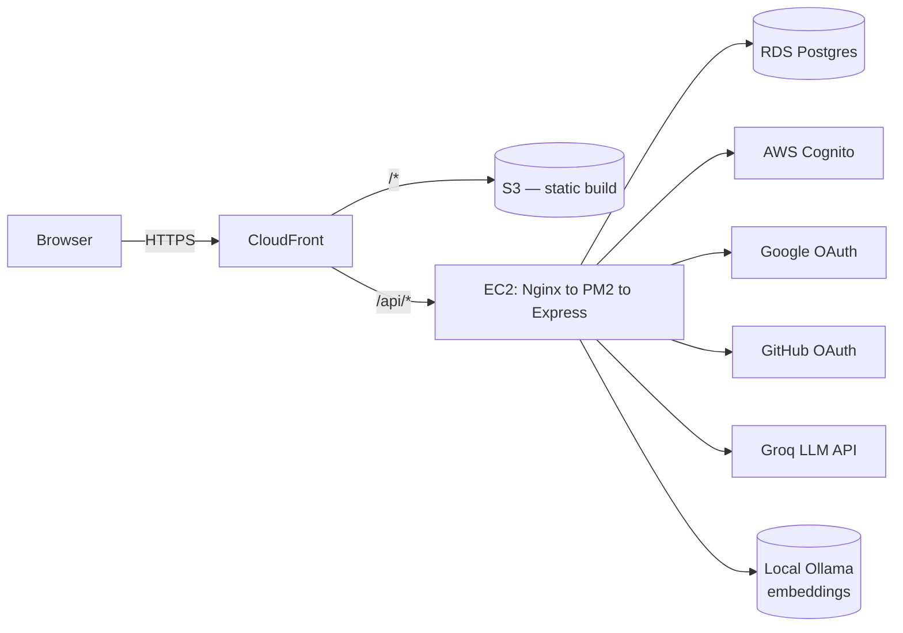
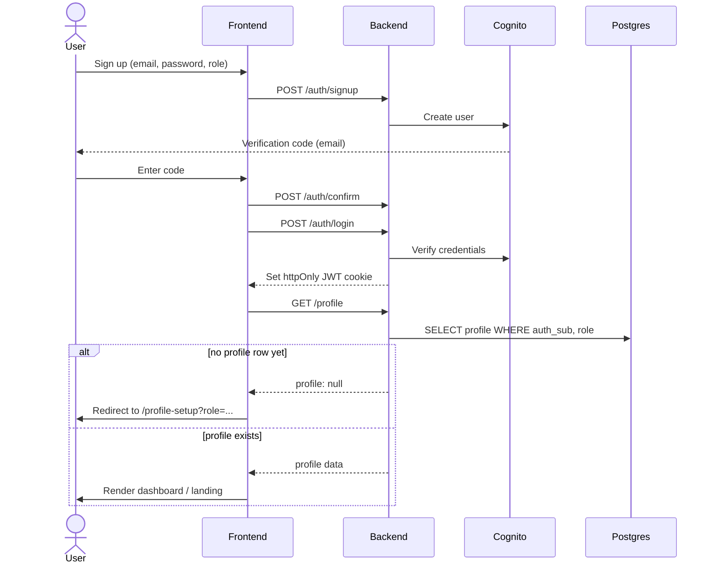
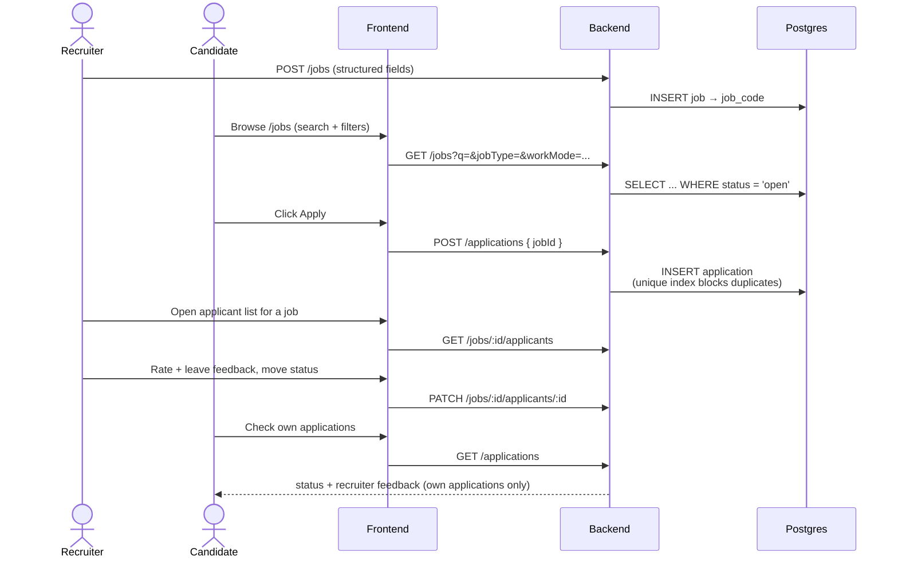
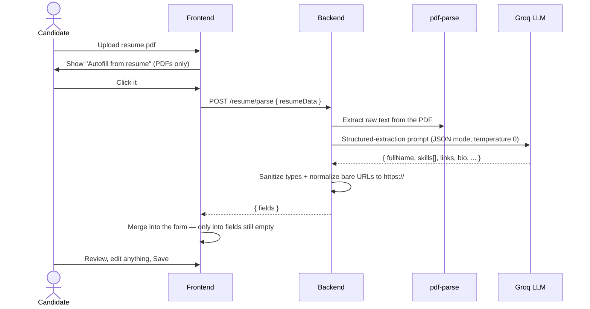

<div align="center">

# Intervu

**AI-native job platform** connecting candidates and recruiters — resume-driven job matching, a two-sided application pipeline, an AI resume assistant grounded in real hiring guides, and one account that can hold both a candidate and a recruiter identity at once.

[](https://github.com/varuntutejaa/intervu/actions/workflows/deploy.yml)
[](https://github.com/varuntutejaa/intervu/actions/workflows/deploy-frontend.yml)


**[Live app →](https://d2sbflfh62ti4k.cloudfront.net)**

</div>

---

## Table of contents

- [Overview](#overview)
- [Features](#features)
- [Tech stack](#tech-stack)
- [Architecture](#architecture)
- [Key flows](#key-flows)
- [Frontend architecture](#frontend-architecture)
- [AI Resume Assistant (RAG pipeline)](#ai-resume-assistant-rag-pipeline)
- [AI resume parsing & autofill](#ai-resume-parsing--autofill)
- [Project structure](#project-structure)
- [Getting started](#getting-started)
- [Environment variables](#environment-variables)
- [API reference](#api-reference)
- [Deployment](#deployment)
- [Security notes](#security-notes)
- [Known limitations](#known-limitations)

---

## Overview

Intervu is a full-stack job platform with two distinct experiences behind one login system:

- **Candidates** build a profile (AI-autofillable straight from an uploaded resume), browse open roles, and apply — with duplicate-application protection and a real applications dashboard.
- **Recruiters** post jobs (auto-assigned a shareable 6-digit reference code), browse every candidate who's set up a profile, and see exactly who applied to each posting.
- **One account, both roles.** A person can hold a candidate profile and a recruiter profile simultaneously and switch between them from the navbar — no second signup, no second email required.
- **An AI resume assistant** that only ever answers from a curated knowledge base — never the model's general knowledge — and says so explicitly when it doesn't have a confident answer.

## Features

<details open>
<summary><strong>Auth</strong></summary>

- Email/password via AWS Cognito (email verification flow included); Cognito is the sole system of record for passwords — it hashes and salts them internally, the application never sees or stores a password or its hash
- Google and GitHub sign-in via direct OAuth 2.0 (no third-party auth service in the loop)
- JWT-based auth: the backend signs its own token after login and carries it in an httpOnly cookie — real JWT authentication, not JWT-in-localStorage, and stateless (no server-side session store, so logins survive a backend restart)
- Role-Based Access Control enforced server-side on every protected route (`requireRole` checks the database, not the JWT claim alone) — hiding a button on the frontend is never the actual gate
- Role-aware login: signing in as the wrong role for an account routes you to set that role up, rather than silently logging into the wrong context

</details>

<details open>
<summary><strong>Candidates</strong></summary>

- Guided profile setup — basic info, professional info, technical/soft skills as real tags, LinkedIn/GitHub/portfolio links, resume — with an **AI autofill** option that reads an uploaded resume and pre-fills the whole form (see [AI resume parsing & autofill](#ai-resume-parsing--autofill))
- Resume upload, view, replace, and delete, with an upload-timestamp shown alongside it
- Job board with search plus job type / work mode / experience / salary filters
- One-click apply with a full job-detail view (description, skills, deadline)
- Application tracker: applications to jobs posted on Intervu and applications made elsewhere (manually logged with company/position/date) live in one list
- Full 6-stage status pipeline — Applied → Interview Scheduled → Technical Round → HR Round → Offer Received / Rejected — editable by the candidate at any time
- Search, filter by status, sort by applied date, and delete on the applications dashboard
- View structured recruiter feedback (ratings, strengths, weaknesses, recommendation) on their own applications only
- Ask the **AI Resume Assistant** free-form questions ("Is my resume ATS-friendly?", "What backend skills am I missing?") and get a grounded, cited answer

</details>

<details open>
<summary><strong>Recruiters</strong></summary>

- Post a job with structured fields (type, mode, experience, salary range, skills, deadline) — auto-assigned a shareable 6-digit reference code
- Edit or close/reopen a posting after it's live
- Recruiter dashboard listing every job they've posted, plus platform-wide stats: total candidates, resumes uploaded, applications per status, top applied companies, interview completion rate
- Per-job applicant view — every candidate who applied, with their full profile and resume
- Move an applicant through the status pipeline and leave structured post-interview feedback (technical/communication/overall ratings, strengths, weaknesses, hire recommendation)
- Browse all candidates platform-wide

</details>

<details open>
<summary><strong>Platform</strong></summary>

- Dual-role accounts with an explicit "Switch to Recruiter/Candidate" action
- Profile pictures and company logos (stored inline, capped client-side)
- Consistent dark UI with a shared design system across every page
- Every list/detail view in the app handles loading, error, *and* empty states — not just the happy path

</details>

## Tech stack

| Layer | Technology |
|---|---|
| Frontend | React 19, TypeScript, Vite, Tailwind CSS v4, Framer Motion |
| Routing | React Router 7 (protected + role-based routes) |
| Data fetching | TanStack Query (server state, caching, loading/error/empty states) |
| Client state | Zustand (see [Frontend architecture](#frontend-architecture) for why) |
| Forms | React Hook Form + Zod |
| Backend | Node.js, Express, TypeScript |
| Database | PostgreSQL (AWS RDS) |
| Auth | AWS Cognito (email/password) + direct Google/GitHub OAuth |
| AI Resume Assistant | Groq (chat, OpenAI-compatible API) + local Ollama (`nomic-embed-text` embeddings), FAISS (`faiss-node`), LangChain text splitters, `pdf-parse` |
| AI Resume Autofill | Groq structured JSON extraction + `pdf-parse` (shares the Groq client with the assistant above) |
| Hosting — frontend | AWS S3 (private) behind AWS CloudFront |
| Hosting — backend | AWS EC2 (Ubuntu) + Nginx reverse proxy + PM2 |
| CI/CD | GitHub Actions (separate backend/frontend deploy workflows) |

## Architecture



Frontend and backend are served from the **same CloudFront domain** — CloudFront routes `/api/*` to the EC2 backend and everything else to the S3-hosted static build. That means no CORS configuration and no mixed-content issues in production, and the auth cookie works exactly the same way as it does in local dev (where Vite's dev server proxies `/api` to the backend instead).

## Key flows

<details>
<summary><strong>Auth & role setup</strong> — signup/login through to a usable profile</summary>



Google/GitHub sign-in follows the same shape via a full-page OAuth redirect instead of steps 1–4; either way it lands back on `/`, and the frontend's `HomeRoute` runs the same "does this role have a profile yet" check before deciding where to send them.

</details>

<details>
<summary><strong>Job discovery → apply → recruiter feedback</strong></summary>



</details>

<details>
<summary><strong>AI Resume Assistant</strong> — retrieval-augmented chat, grounded and citable</summary>


Full detail in [AI Resume Assistant (RAG pipeline)](#ai-resume-assistant-rag-pipeline).

</details>

<details>
<summary><strong>AI resume parsing & autofill</strong> — one click from PDF to a filled-in profile</summary>



Full detail in [AI resume parsing & autofill](#ai-resume-parsing--autofill).

</details>

## Frontend architecture

The frontend is organized by **feature** (`src/features/<feature>/{api,schema,pages,components}.ts(x)`), not by file type — `auth`, `profile`, `jobs`, `applications`, `recruiter-dashboard`, `candidates`, `landing`. Cross-feature UI (the Aurora design-system primitives, the top nav) lives in `src/components/`; `src/types.ts` holds the two types shared everywhere (`Role`, `NavUser`).

**Routing.** `src/app/router.tsx` defines the route table with `react-router-dom`'s `createBrowserRouter`. Two layout-route guards gate access:
- `RequireAuth` — any authenticated user (mirrors the backend's `getAuthUser`-only checks, e.g. `GET/POST /api/profile`). Redirects to `/login` if there's no session.
- `RequireRole(role)` — authenticated *and* holding a profile for that role (mirrors the backend's `requireRole(req, res, role)` gate on jobs/candidates/applications routes). An authenticated account that just hasn't set up that role yet is sent to `/profile-setup?role=...` rather than a dead-end — the same "let them set it up" behavior the product already had for role-switching.
- `/` is a smart entry point: a logged-in recruiter is redirected to `/recruiter/dashboard`; everyone else sees the landing/chat page.

**Data fetching.** Every network call goes through TanStack Query (`useQuery`/`useMutation`) via a thin `apiFetch`/`apiJson` helper (`src/lib/api.ts`) that centralizes error-message extraction and the "can't reach the server" case. Every list/detail view renders three explicit states — pending (skeleton/loading text), error (inline message, and a retry action where relevant), and empty (an explicit "no X yet" message) — not just the happy path.

**Forms.** Every data-entry form (login, signup, profile setup/edit, post/edit job, log an application, applicant feedback) uses React Hook Form with a Zod schema (`zodResolver`) per feature in `schema.ts`. The existing hand-styled input components (`InputGroup`, `SelectGroup`, `TagInput`, etc.) stayed fully controlled rather than being rewritten — they're wired into RHF via `<Controller>`, which is the standard low-risk way to bring RHF into a codebase with pre-existing controlled components, so the visual design didn't need to change to add real validation.

**Global state management.** TanStack Query owns every piece of server-derived state, *including the session itself* — `useSessionQuery()` (`GET /api/auth/me`) is the single source of truth for who's logged in and which roles they hold, consumed directly by the nav bar and both route guards. Deliberately **not** duplicated into a separate store: mirroring server state into client state is a well-known source of stale-cache bugs (the two copies drift), so login/logout/switch-role/save-profile mutations just update the query cache (`setQueryData`/`invalidateQueries`) and everything downstream re-renders from one source.

That leaves almost nothing that's genuinely *global client-only* state — with one real exception: which role (candidate/recruiter) someone is signing up or logging in as, picked before an account/session exists to hang it off of, and needed across three separate routes (`/login`, `/signup`, `/profile-setup`) with no natural single owner. That one field lives in a **Zustand** store (`features/auth/store.ts`). Zustand was chosen over the alternatives for this specific, narrow need:
- **Redux/Redux Toolkit** — real boilerplate (actions, reducers, a provider) to manage a single optional string; nothing else in the app needs a centralized reducer or time-travel debugging.
- **Plain React Context** — would work, but a context provider re-renders every consumer on any change, and there's no reason for (say) the nav bar and the signup form to be coupled through one provider tree for a value that changes rarely. Zustand's selector-based subscriptions (`useAuthFlowStore((s) => s.pendingRole)`) avoid that coupling for free, with no provider to wire up at all.
- Zustand is also the pragmatic choice if this ever needs to grow (e.g. a client-side toast queue) — it's ~1KB, has no boilerplate, and doesn't fight with TanStack Query's cache the way syncing server data into a second store would.

## AI Resume Assistant (RAG pipeline)

The landing-page chat is backed by a real Retrieval-Augmented Generation pipeline in `backend/src/rag/`, not a fake/local echo. It answers **only** from a curated knowledge base (`backend/knowledge/*.pdf`) and refuses to answer when retrieval confidence is too low, rather than falling back to the model's general knowledge.

- **Chat:** Groq, via its OpenAI-compatible `/openai/v1` endpoint (the `openai` SDK works against it unmodified, just a different `baseURL`) — free tier, no local model to run.
- **Embeddings:** local Ollama (`nomic-embed-text` by default), also via an OpenAI-compatible endpoint — runs entirely on this machine, no API key, no per-token cost. Requires Ollama installed and running (`ollama pull nomic-embed-text` once), since Groq has no embeddings API of its own.
- **Two chunking strategies**, both built by `npm run ingest` every time so switching is a pure config change: Strategy A (`small`, ~300 words / 50 overlap) and Strategy B (`large`, ~700 words / 100 overlap). `CHUNK_STRATEGY` picks which one `/api/chat` queries at runtime.
- **Vector store:** `faiss-node` (flat inner-product index over L2-normalized embeddings, i.e. cosine similarity), persisted to disk alongside a JSON metadata sidecar (`{source, page, chunk}` per vector).
- **Retrieval → generation:** top-K chunks are retrieved; if the top similarity score is below `RAG_SIMILARITY_THRESHOLD`, the API returns the "I could not find sufficient information..." fallback **without calling the LLM at all**. Otherwise the chunks are assembled into a strict "use only this context" prompt and sent to the configured chat model.
- Every field (`GROQ_CHAT_MODEL`, `OLLAMA_EMBEDDING_MODEL`, `CHUNK_STRATEGY`, `RAG_TOP_K`, `RAG_SIMILARITY_THRESHOLD`) is an env var — see [Environment variables](#environment-variables).

`POST /api/chat` returns `{ answer, citations: [{ document, page }] }`, which the frontend (`features/landing`) renders as the assistant's reply plus a references list.

## AI resume parsing & autofill

Setting up a candidate profile has an **"Autofill from resume"** action once a PDF is picked — it doesn't just store the file, it reads it.

- `POST /api/resume/parse` extracts raw text from the uploaded PDF with `pdf-parse`, then sends it to Groq (the same client the RAG assistant uses, factored into `backend/src/lib/groq.ts`) with a strict structured-extraction system prompt and `response_format: json_object`, at `temperature: 0`.
- The model returns full name, phone, location, desired role, an experience bracket, technical/soft skills, LinkedIn/GitHub/portfolio links, and a written summary — all in one call.
- The backend **sanitizes** the response before it ever reaches the frontend: every field is type-checked, `experience` is constrained to the five real select options (anything else becomes empty rather than silently breaking the `<select>`), and bare URLs like `linkedin.com/in/x` (how people actually write them on paper resumes) get `https://` prepended so they pass the frontend's own validation.
- The frontend merges the result into the form **field-by-field, only where the field is still empty** — autofill fills gaps, it never overwrites something the candidate already typed by hand.
- Available on both the initial profile-setup page and the profile-edit page, and works for a brand-new signup with no profile row yet — the endpoint authenticates the request but deliberately doesn't require an existing candidate profile (`getAuthUser`, not `requireRole("candidate")`), which is exactly the state a first-time setup is in.

## Project structure

<details>
<summary>Expand full tree</summary>

```
backend/
  knowledge/            # PDFs auto-ingested into the RAG knowledge base
  data/rag/<strategy>/   # Generated FAISS indexes + metadata (gitignored build output)
  scripts/ingest.ts      # npm run ingest — builds both chunking-strategy indexes
  src/
    index.ts             # Express app entry point
    routes/               # One file per resource: auth, oauth, profile, jobs, candidates, applications, chat, resume
    middleware/            # asyncHandler, requireRole, auth (JWT cookie read/set/clear)
    lib/                    # db pool, Cognito client, JWT sign/verify, profile-role helpers, groq.ts (shared Groq client)
    rag/                    # config, pdfLoader, chunker, embeddings, vectorStore, retriever, prompt, llm, ragService

frontend/src/
  main.tsx, index.css   # Entry point, global styles
  app/                   # router.tsx (routes + RequireAuth/RequireRole), queryClient.ts, providers.tsx
  types.ts               # Shared Role / NavUser types
  components/             # Cross-feature UI: aurora/ (design system primitives, TagInput), chrome/ (NavBar)
  lib/                    # api.ts (fetch helper), files.ts (data-URL encoding, size caps)
  features/
    auth/                 # api (session query + mutations), schema (Zod), store (Zustand), pages
    profile/              # Profile + ProfileSetup pages, AvatarPicker, candidate/recruiter field components
    jobs/                  # Job board + post-a-job, shared job-form Zod schema
    applications/          # Candidate applications dashboard
    recruiter-dashboard/   # Stats, job postings, applicants + feedback (EditJobModal/ApplicantsModal/ApplicantCard)
    candidates/            # Recruiter-facing candidate directory
    landing/               # Marketing page + AI Resume Assistant chat UI

infra/                  # CloudFront distribution config + S3 bucket policy (reference/reproducibility)
.github/workflows/       # deploy.yml (backend to EC2), deploy-frontend.yml (S3 + CloudFront)
```

</details>

## Getting started

**Prerequisites:** Node.js 20+, a PostgreSQL database (AWS RDS or local), an AWS Cognito User Pool, [Ollama](https://ollama.com) installed locally, a free [Groq](https://console.groq.com/keys) API key.

**Backend**

```bash
cd backend
cp .env.example .env          # fill in RDS + Cognito + OAuth + GROQ_API_KEY — see below
npm install
node scripts/init-db.mjs      # creates the database (if missing) and applies schema.sql
ollama pull nomic-embed-text  # one-time — local embedding model for the RAG pipeline
npm run ingest                 # builds both RAG chunking-strategy indexes from backend/knowledge/*.pdf
npm run dev                    # http://localhost:3001
```

**Frontend**

```bash
cd frontend
npm install
npm run dev               # http://localhost:5174, proxies /api to the backend
```

Both servers need to be running locally — the frontend has no build-time environment variables of its own; everything (including OAuth) is driven server-side.

## Environment variables

All backend configuration lives in `backend/.env` (see `backend/.env.example` for the full annotated list). Nothing is required on the frontend.

<details>
<summary>Full variable reference</summary>

| Variable | Purpose |
|---|---|
| `PGHOST`, `PGPORT`, `PGDATABASE`, `PGUSER`, `PGPASSWORD` (or `DATABASE_URL`) | Postgres connection |
| `DB_SSL` | Set `true` for RDS (default) |
| `PORT` | Backend listen port (default `3001`) |
| `CORS_ORIGIN` | Allowed frontend origin for CORS |
| `PUBLIC_URL` | The externally-reachable origin the app is served from — used to build OAuth redirect URIs and the post-login redirect target |
| `COGNITO_REGION`, `COGNITO_CLIENT_ID`, `COGNITO_CLIENT_SECRET` | Cognito User Pool app client |
| `JWT_SECRET` | Random string signing this app's own auth JWT (httpOnly cookie) |
| `GOOGLE_CLIENT_ID`, `GOOGLE_CLIENT_SECRET` | Google OAuth client |
| `GITHUB_CLIENT_ID`, `GITHUB_CLIENT_SECRET` | GitHub OAuth App |
| `GROQ_API_KEY` | Required for the AI Resume Assistant's chat model and resume-autofill extraction ([console.groq.com/keys](https://console.groq.com/keys), free tier) |
| `GROQ_CHAT_MODEL` | Chat model for grounded answers and resume extraction (default `llama-3.3-70b-versatile`) |
| `OLLAMA_BASE_URL` | Local Ollama server for embeddings (default `http://localhost:11434`) — Ollama must be installed and running |
| `OLLAMA_EMBEDDING_MODEL` | Embedding model (default `nomic-embed-text`, pulled via `ollama pull nomic-embed-text`) — changing this requires re-running `npm run ingest` |
| `CHUNK_STRATEGY` | `small` (Strategy A, ~300w/50 overlap) or `large` (Strategy B, ~700w/100 overlap) — which pre-built index `/api/chat` queries |
| `RAG_TOP_K` | Chunks retrieved per question (default `5`) |
| `RAG_SIMILARITY_THRESHOLD` | Minimum cosine similarity (0–1) before the LLM is even called (default `0.75`) |

</details>

## API reference

All routes are mounted under `/api`. JWT-authenticated routes read this app's own signed JWT from an httpOnly cookie set at login (see [Security notes](#security-notes)); role-gated routes 403 if the account doesn't have that profile — checked against the database on every request, not just the JWT claim.

<details>
<summary>Full endpoint reference</summary>

| Method | Path | Auth | Description |
|---|---|---|---|
| POST | `/auth/signup` | — | Create a Cognito account, sends a verification code |
| POST | `/auth/confirm` | — | Confirm the verification code |
| POST | `/auth/resend-code` | — | Resend the verification code |
| POST | `/auth/login` | — | Email/password login |
| GET | `/auth/google/start`, `/auth/github/start` | — | Kick off OAuth redirect |
| GET | `/auth/google/callback`, `/auth/github/callback` | — | OAuth callback, sets the auth cookie |
| POST | `/auth/logout` | JWT | Clear the auth cookie |
| GET | `/auth/me` | JWT | Current user, active role, and all roles the account has |
| POST | `/auth/switch-role` | JWT | Change which profile (candidate/recruiter) is active |
| GET | `/profile` | JWT | Fetch the active (or `?role=`) profile |
| POST | `/profile` | JWT | Create/update a profile for a given role |
| DELETE | `/profile/resume` | Candidate | Remove the candidate's uploaded resume |
| POST | `/resume/parse` | JWT | AI resume autofill — `{ resumeData }` in, extracted `{ fields }` out; see [AI resume parsing & autofill](#ai-resume-parsing--autofill) |
| GET | `/jobs` | — | Public job listing (search + type/mode/experience/location filters) |
| GET | `/jobs/mine` | Recruiter | Jobs posted by the current account |
| GET | `/jobs/stats` | Recruiter | Own posting stats plus platform-wide candidate/resume/company/interview figures |
| GET | `/jobs/:id/applicants` | Recruiter (owner) | Applicants for a specific job |
| PATCH | `/jobs/:id/applicants/:applicationId` | Recruiter (owner) | Update an applicant's status and structured interview feedback |
| POST | `/jobs` | Recruiter | Post a new job |
| PATCH | `/jobs/:id` | Recruiter (owner) | Edit a posting, or close/reopen it via `{ status }` |
| GET | `/candidates` | Recruiter | Every candidate profile |
| GET | `/applications` | Candidate | The current account's applications (`?q=`, `?status=`, `?sort=asc\|desc`) |
| POST | `/applications` | Candidate | Apply to a posted job (`jobId`), or log one made elsewhere (`company` + `position`) |
| PATCH | `/applications/:id` | Candidate (owner) | Update status, company, position, or applied date |
| DELETE | `/applications/:id` | Candidate (owner) | Remove an application |
| POST | `/chat` | — | AI Resume Assistant — `{ question }` in, `{ answer, citations }` out; see [AI Resume Assistant (RAG pipeline)](#ai-resume-assistant-rag-pipeline) |
| GET | `/health` | — | Liveness check, verifies DB connectivity |

</details>

## Deployment

**Backend** — an EC2 instance runs the Express app under PM2 (auto-restarts on crash and on instance reboot via a systemd unit), with Nginx reverse-proxying port 80 to the app. `deploy.yml` SSHes in on every push to `main` touching `backend/**`, pulls, rebuilds, and restarts PM2.

**Frontend** — `deploy-frontend.yml` builds the Vite app and syncs it to a private S3 bucket on every push to `main` touching `frontend/**`, then invalidates the CloudFront cache. The S3 bucket has no public access — it's only reachable through CloudFront via an Origin Access Control.

Both workflows also support manual runs via `workflow_dispatch` from the Actions tab.

## Security notes

- **Password hashing:** passwords never touch the application layer — Cognito is the sole system of record for them and hashes/salts every password internally (industry-standard SRP-based storage); the app never sees, stores, or has access to a password or its hash. Building a second, parallel password store here would be a strictly worse security posture than delegating to Cognito.
- **JWT authentication:** the backend signs its own JWT after login (`lib/jwt.ts`) and carries it in an `httpOnly`, `sameSite=lax` cookie — `secure` is enabled automatically in production. This is a real, stateless JWT (no server-side session store — a backend restart no longer logs anyone out), while still keeping the XSS protection of `httpOnly` that JWT-in-localStorage gives up.
- **RBAC enforced server-side:** `requireRole` checks the `profiles` table on every protected request — the frontend hiding a button is a UX nicety, never the actual gate. A recruiter can only see applicants for jobs *they* posted; a candidate can only see their own applications and only their own interview feedback.
- Every database query is parameterized (no string-built SQL)
- OAuth client secrets, the Cognito app secret, and the Groq API key never reach the frontend bundle

## Known limitations

- Resumes, company logos, and avatars are stored inline (base64/filename only) — no S3 object storage wired up for user uploads yet
- No rate limiting on auth endpoints beyond what Cognito enforces natively
- The EC2 instance is a single node — no load balancer or auto-scaling
- Forgot-password is a client-side-only confirmation screen — no backend reset-password endpoint exists yet
- The AI Resume Assistant's *chat* answers from the curated `backend/knowledge/` PDFs only — it doesn't read a candidate's own resume (that's the separate autofill feature above, which is a one-shot extraction, not part of the chat's retrieval context)
- The AI Resume Assistant's embeddings require Ollama running locally (`ollama pull nomic-embed-text`) — `npm run ingest` and `/api/chat` both fail if it isn't reachable at `OLLAMA_BASE_URL`
