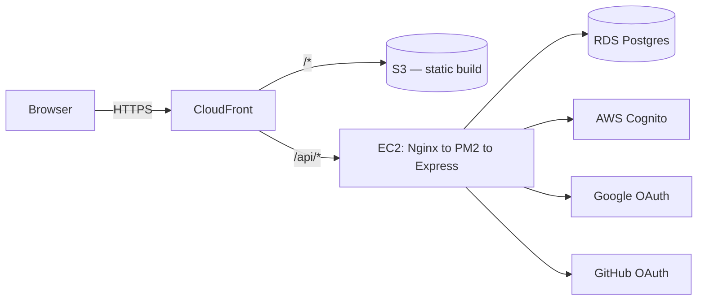

# Intervu

AI-assisted job platform connecting candidates and recruiters — resume-driven job matching, a two-sided application pipeline, and a single account that can hold both a candidate and a recruiter identity at once.

[](https://github.com/varuntutejaa/intervu/actions/workflows/deploy.yml)
[](https://github.com/varuntutejaa/intervu/actions/workflows/deploy-frontend.yml)

**Live app:** [d2sbflfh62ti4k.cloudfront.net](https://d2sbflfh62ti4k.cloudfront.net)

---

## Table of contents

- [Overview](#overview)
- [Features](#features)
- [Tech stack](#tech-stack)
- [Architecture](#architecture)
- [Project structure](#project-structure)
- [Getting started](#getting-started)
- [Environment variables](#environment-variables)
- [API reference](#api-reference)
- [Deployment](#deployment)
- [Security notes](#security-notes)
- [Known limitations](#known-limitations)

---

## Overview

Intervu is a full-stack job platform with two distinct experiences behind one login system:

- **Candidates** build a profile, browse open roles, and apply — with duplicate-application protection and a real applications dashboard.
- **Recruiters** post jobs (auto-assigned a 6-digit reference code), browse every candidate who's set up a profile, and see exactly who applied to each posting.
- **One account, both roles.** A person can hold a candidate profile and a recruiter profile simultaneously and switch between them from the navbar — no second signup, no second email required.

## Features

**Auth**
- Email/password via AWS Cognito (email verification flow included); Cognito is the sole system of record for passwords — it hashes and salts them internally, the application never sees or stores a password or its hash
- Google and GitHub sign-in via direct OAuth 2.0 (no third-party auth service in the loop)
- JWT-based auth: the backend signs its own token after login and carries it in an httpOnly cookie — real JWT authentication, not JWT-in-localStorage, and stateless (no server-side session store, so logins survive a backend restart)
- Role-Based Access Control enforced server-side on every protected route (`requireRole` checks the database, not the JWT claim alone) — hiding a button on the frontend is never the actual gate
- Role-aware login: signing in as the wrong role for an account routes you to set that role up, rather than silently logging into the wrong context

**Candidates**
- Guided profile setup (desired role, experience, skills, portfolio, resume, bio, avatar)
- Resume upload, view, replace, and delete (PDF/DOC/DOCX, capped client-side)
- Job board with search plus job type / work mode / experience / salary filters
- One-click apply with a full job-detail view (description, skills, deadline)
- Application tracker: applications to jobs posted on Intervu and applications made elsewhere (manually logged with company/position/date) live in one list
- Full 6-stage status pipeline — Applied → Interview Scheduled → Technical Round → HR Round → Offer Received / Rejected — editable by the candidate at any time
- Search, filter by status, sort by applied date, and delete on the applications dashboard
- View structured recruiter feedback (ratings, strengths, weaknesses, recommendation) on their own applications only

**Recruiters**
- Post a job with structured fields (type, mode, experience, salary range, skills, deadline) — auto-assigned a shareable 6-digit reference code
- Edit or close/reopen a posting after it's live
- Recruiter dashboard listing every job they've posted, plus platform-wide stats: total candidates, resumes uploaded, applications per status, top applied companies, interview completion rate
- Per-job applicant view — every candidate who applied, with their full profile and resume
- Move an applicant through the status pipeline and leave structured post-interview feedback (technical/communication/overall ratings, strengths, weaknesses, hire recommendation)
- Browse all candidates platform-wide

**Platform**
- Dual-role accounts with an explicit "Switch to Recruiter/Candidate" action
- Profile pictures and company logos (stored inline, capped client-side)
- Consistent dark UI with a shared design system across every page

## Tech stack

| Layer | Technology |
|---|---|
| Frontend | React 19, TypeScript, Vite, Tailwind CSS v4, Framer Motion |
| Backend | Node.js, Express, TypeScript |
| Database | PostgreSQL (AWS RDS) |
| Auth | AWS Cognito (email/password) + direct Google/GitHub OAuth |
| Hosting — frontend | AWS S3 (private) behind AWS CloudFront |
| Hosting — backend | AWS EC2 (Ubuntu) + Nginx reverse proxy + PM2 |
| CI/CD | GitHub Actions (separate backend/frontend deploy workflows) |

## Architecture



Frontend and backend are served from the **same CloudFront domain** — CloudFront routes `/api/*` to the EC2 backend and everything else to the S3-hosted static build. That means no CORS configuration and no mixed-content issues in production, and the auth cookie works exactly the same way as it does in local dev (where Vite's dev server proxies `/api` to the backend instead).

## Project structure

```
backend/src/
  index.ts            # Express app entry point
  routes/              # One file per resource: auth, oauth, profile, jobs, candidates, applications
  middleware/           # asyncHandler, requireRole, auth (JWT cookie read/set/clear)
  lib/                  # db pool, Cognito client, JWT sign/verify, profile-role helpers, application status list

frontend/src/
  App.tsx              # Client-side router / route table
  main.tsx, index.css  # Entry point, global styles
  pages/                # One file per route (Login, Signup, Jobs, Profile, RecruiterDashboard, ...)
  components/           # Shared UI: AuroraLayout (design system), LandingChrome (navbar), ProfileFields
  lib/                  # router.ts — minimal pathname-based router

infra/                  # CloudFront distribution config + S3 bucket policy (reference/reproducibility)
.github/workflows/       # deploy.yml (backend to EC2), deploy-frontend.yml (S3 + CloudFront)
```

## Getting started

**Prerequisites:** Node.js 20+, a PostgreSQL database (AWS RDS or local), an AWS Cognito User Pool.

**Backend**

```bash
cd backend
cp .env.example .env     # fill in RDS + Cognito + OAuth credentials — see below
npm install
node scripts/init-db.mjs # creates the database (if missing) and applies schema.sql
npm run dev               # http://localhost:3001
```

**Frontend**

```bash
cd frontend
npm install
npm run dev               # http://localhost:5174, proxies /api to the backend
```

Both servers need to be running locally — the frontend has no build-time environment variables of its own; everything (including OAuth) is driven server-side.

## Environment variables

All backend configuration lives in `backend/.env` (see `backend/.env.example` for the full annotated list). Nothing is required on the frontend.

| Variable | Purpose |
|---|---|
| `PGHOST`, `PGPORT`, `PGDATABASE`, `PGUSER`, `PGPASSWORD` (or `DATABASE_URL`) | Postgres connection |
| `DB_SSL` | Set `true` for RDS (default) |
| `PORT` | Backend listen port (default `3001`) |
| `CORS_ORIGIN` | Allowed frontend origin for CORS |
| `PUBLIC_URL` | The externally-reachable origin the app is served from — used to build OAuth redirect URIs and the post-login redirect target |
| `COGNITO_REGION`, `COGNITO_CLIENT_ID`, `COGNITO_CLIENT_SECRET` | Cognito User Pool app client |
| `JWT_SECRET` | Random string signing this app's own auth JWT (httpOnly cookie) |
| `GOOGLE_CLIENT_ID`, `GOOGLE_CLIENT_SECRET` | Google OAuth client |
| `GITHUB_CLIENT_ID`, `GITHUB_CLIENT_SECRET` | GitHub OAuth App |

## API reference

All routes are mounted under `/api`. JWT-authenticated routes read this app's own signed JWT from an httpOnly cookie set at login (see [Security notes](#security-notes)); role-gated routes 403 if the account doesn't have that profile — checked against the database on every request, not just the JWT claim.

| Method | Path | Auth | Description |
|---|---|---|---|
| POST | `/auth/signup` | — | Create a Cognito account, sends a verification code |
| POST | `/auth/confirm` | — | Confirm the verification code |
| POST | `/auth/resend-code` | — | Resend the verification code |
| POST | `/auth/login` | — | Email/password login |
| GET | `/auth/google/start`, `/auth/github/start` | — | Kick off OAuth redirect |
| GET | `/auth/google/callback`, `/auth/github/callback` | — | OAuth callback, sets the auth cookie |
| POST | `/auth/logout` | JWT | Clear the auth cookie |
| GET | `/auth/me` | JWT | Current user, active role, and all roles the account has |
| POST | `/auth/switch-role` | JWT | Change which profile (candidate/recruiter) is active |
| GET | `/profile` | JWT | Fetch the active (or `?role=`) profile |
| POST | `/profile` | JWT | Create/update a profile for a given role |
| DELETE | `/profile/resume` | Candidate | Remove the candidate's uploaded resume |
| GET | `/jobs` | — | Public job listing (search + type/mode/experience/location filters) |
| GET | `/jobs/mine` | Recruiter | Jobs posted by the current account |
| GET | `/jobs/stats` | Recruiter | Own posting stats plus platform-wide candidate/resume/company/interview figures |
| GET | `/jobs/:id/applicants` | Recruiter (owner) | Applicants for a specific job |
| PATCH | `/jobs/:id/applicants/:applicationId` | Recruiter (owner) | Update an applicant's status and structured interview feedback |
| POST | `/jobs` | Recruiter | Post a new job |
| PATCH | `/jobs/:id` | Recruiter (owner) | Edit a posting, or close/reopen it via `{ status }` |
| GET | `/candidates` | Recruiter | Every candidate profile |
| GET | `/applications` | Candidate | The current account's applications (`?q=`, `?status=`, `?sort=asc\|desc`) |
| POST | `/applications` | Candidate | Apply to a posted job (`jobId`), or log one made elsewhere (`company` + `position`) |
| PATCH | `/applications/:id` | Candidate (owner) | Update status, company, position, or applied date |
| DELETE | `/applications/:id` | Candidate (owner) | Remove an application |
| GET | `/health` | — | Liveness check, verifies DB connectivity |

## Deployment

**Backend** — an EC2 instance runs the Express app under PM2 (auto-restarts on crash and on instance reboot via a systemd unit), with Nginx reverse-proxying port 80 to the app. `deploy.yml` SSHes in on every push to `main` touching `backend/**`, pulls, rebuilds, and restarts PM2.

**Frontend** — `deploy-frontend.yml` builds the Vite app and syncs it to a private S3 bucket on every push to `main` touching `frontend/**`, then invalidates the CloudFront cache. The S3 bucket has no public access — it's only reachable through CloudFront via an Origin Access Control.

Both workflows also support manual runs via `workflow_dispatch` from the Actions tab.

## Security notes

- **Password hashing:** passwords never touch the application layer — Cognito is the sole system of record for them and hashes/salts every password internally (industry-standard SRP-based storage); the app never sees, stores, or has access to a password or its hash. Building a second, parallel password store here would be a strictly worse security posture than delegating to Cognito.
- **JWT authentication:** the backend signs its own JWT after login (`lib/jwt.ts`) and carries it in an `httpOnly`, `sameSite=lax` cookie — `secure` is enabled automatically in production. This is a real, stateless JWT (no server-side session store — a backend restart no longer logs anyone out), while still keeping the XSS protection of `httpOnly` that JWT-in-localStorage gives up.
- **RBAC enforced server-side:** `requireRole` checks the `profiles` table on every protected request — the frontend hiding a button is a UX nicety, never the actual gate. A recruiter can only see applicants for jobs *they* posted; a candidate can only see their own applications and only their own interview feedback.
- Every database query is parameterized (no string-built SQL)
- OAuth client secrets and the Cognito app secret never reach the frontend bundle

## Known limitations

- Resumes, company logos, and avatars are stored inline (base64/filename only) — no S3 object storage wired up for user uploads yet
- No rate limiting on auth endpoints beyond what Cognito enforces natively
- The EC2 instance is a single node — no load balancer or auto-scaling
